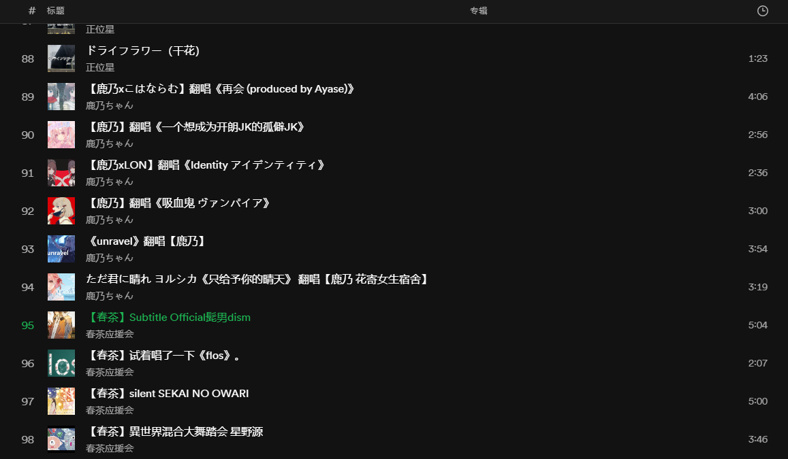

# Bili-voiceload

一个简单有效的B站音频命令行下载工具。

## Feature list
- [x] 使用 Rust 实现的多线程下载，tokio + reqwest 组合。
- [x] 支持的解析类型
  - [x] av/bv 号
  - [x] 链接
  - [x] 文件内容
- [x] 支持的转换格式
  - [x] m4a
  - [x] flac（需要稿件支持并带上拥有大会员权限的 SESSIONDATA ）
  - [ ] dolby
- [x] 支持添加封面。（目前是直接使用视频封面）
- [ ] 支持字幕。
- [ ] 爬虫调用友好。




## Usage

`voiceload` 目前需要与 `ffmpeg` 同一目录进行调用解析音频。

```text
A simple cli tool for downloading audio in bilibili.

Usage: voiceload.exe [OPTIONS]

Options:
  -i, --inputs <INPUTS>
          aid/bvid/link to download, can be multiple
  -f, --file-input <FILE_INPUT>
          parsing a file content line by line to get input, split by '\n'
  -F, --flac-allowed <FLAC_ALLOWED>
          Allow downloading flac [default: false] [possible values: true, false]
  -D, --dolby-allowed <DOLBY_ALLOWED>
          Allow downloading dolby [default: false] [possible values: true, false]
  -P, --picture-allowed <PICTURE_ALLOWED>
          Allow adding picture to audio [default: false] [possible values: true, false]
  -p, --path <PATH>
          Path to save audio files [default: ./]
  -o <FILENAME>
          (Optional) Filename to save [default: the title of the audio]
  -s, --session <SESSION>
          (Optional) Sessiondata for login aiming to dolby or flac [default: None]
  -c, --config <CONFIG>
          (Optional) Config file path [default: ./config.json]
  -h, --help
          Print help information
  -V, --version
          Print version information
```

命令行调用例子：
```
./voiceload.exe \
         -i BV1YM411U73a \
         -i av600924585 \
         -f ./ids.txt \
         -P true -F false --path "F:\BiliMusic"
```

运行日志: [Log](./test.log)

同时命令行默认支持读取配置文件，默认文件名是 `./config.json`，也可以使用 `-c/--config` 指定。

```json
{
    "flac_allowed": true,
    "dolby_allowed": true,
    "pic_allowed": true,
    "path": "F:\\BiliMusic",
    "session": "******"
}
```

加载优先级是: 命令行参数 > 配置文件 > 默认设置。